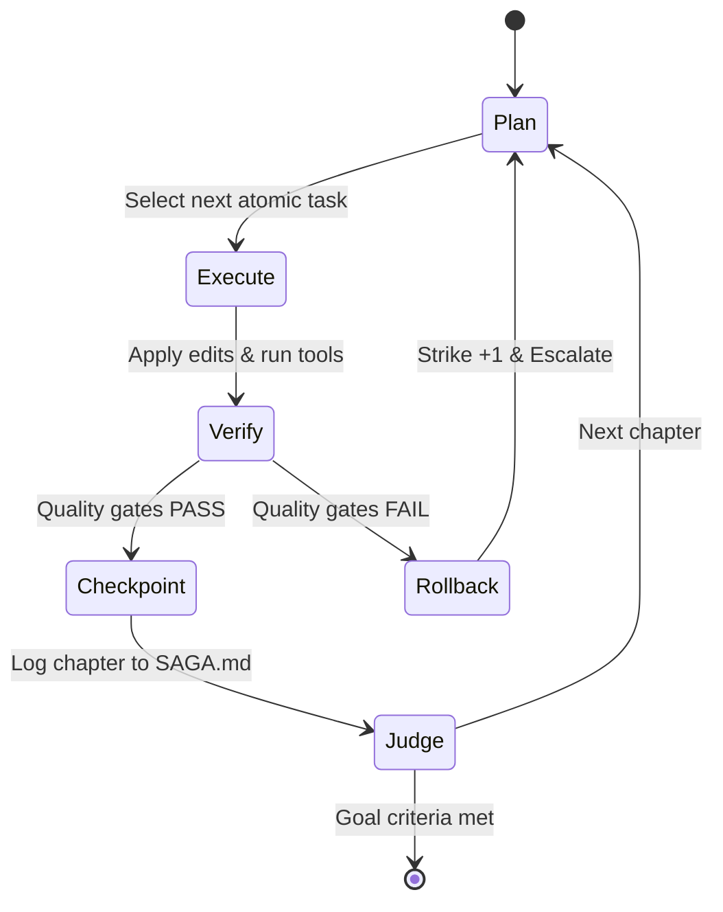

# 10. The careful-progression loop (`saga`)

Status: hardened on 2026-08-26 · supersedes: — · PLAN.md item 10

## Decision (the short version)

**`saga` is Kolkrabbi's autonomous, careful-progression engine designed to advance complex, multi-step engineering goals chapter by chapter without losing control, context, or money.** Where agent mode provides *width* (parallel subagents on a single turn), `saga` provides *longitudinal depth*: executing an overarching objective through a sequence of bounded, verified, atomic iterations called **chapters**.

Each chapter follows a strict five-step contract: (1) inspect progress, (2) execute exactly one bounded change, (3) verify with real shell quality gates (test, build, lint), (4) checkpoint and commit on green, and (5) log the human-readable result to `SAGA.md`. `SAGA.md` lives in the project root as a durable, human-editable artifact that survives machine restarts and anchors the next normal request carrying `/saga`. Execution is self-paced by default, bounded by strict monetary and chapter budgets, protected by a 3-strike doom-loop detector, and cancellable with Esc like any other active turn.

---

## Spec

### 0. ★ North star compliance

#### 0.1 The napkin test
```console
# 1. Start careful progression inside the normal session
$ kolk "migrate sqlite store to pure-go modernc.org/sqlite and verify tests /saga"
◆ saga started: s_20260826-004012-7b1a
◆ goal: migrate sqlite store to pure-go modernc.org/sqlite and verify tests
◆ progress artifact: SAGA.md created

chapter 1: audit existing database package and list dependencies
  → read_file(internal/store/db.go)
  → verification: clean (no code touched)
  ✓ chapter 1 committed [cost: $0.02 · 18s]

chapter 2: replace cgo sqlite import with modernc.org/sqlite
  → edit_file(internal/store/db.go)
  → bash(go test ./internal/store) → ok
  ✓ chapter 2 committed [cost: $0.05 · 42s]

chapter 3: remove cgo build tags and run full test suite
  → edit_file(Makefile)
  → bash(./scripts/test.sh) → 1,385 tests ok
  ✓ chapter 3 committed [cost: $0.04 · 35s]

◆ saga complete: all acceptance criteria verified. Total cost: $0.11 across 3 chapters.
```

#### 0.2 North star rules compliance

| North star rule | How Item 10 complies | Enforced by |
|---|---|---|
| **1. Zero-config is the product** | A normal request containing `/saga` requires zero settings. Default budgets ($5.00, 15 chapters), automatic quality-gate discovery (`go test`, `npm test`, `cargo test`), and progress logging are pre-wired. | `TestSagaZeroConfigLaunch` |
| **2. Every default computed, not asked** | Test and build commands are auto-detected from project files (`go.mod`, `package.json`, `Cargo.toml`, `Makefile`). Verification runs without prompts. | `TestDetectProjectQualityGates` |
| **3. One install command, static binary** | Progress logging uses standard Markdown in `SAGA.md`. Git commits use local git binary via existing `internal/shell`. Zero dependencies added. | `scripts/check-purity.sh` |
| **4. One key command** | Provider keys are shared with the base agent. Model selection defaults to the active `medium` or `high` effort tier. | `TestSagaProviderAgnostic` |
| **5. Complexity ships off, discoverable later** | Custom judge models, webhook notifications, and worktree branching ship off by default. A user appending `/saga` to a normal request gets safe in-place progression. | `TestSagaDefaultsOff` |
| **6. Simple to type beats simple to explain** | Append the four-letter `/saga` marker to any normal request. There is no separate SAGA command family. | `TestSagaCommandGrammar` |

---

### 1. The Chapter Lifecycle State Machine

Each saga iteration executes an atomic loop cycle:



#### 1.1 Step-by-step chapter contract
1. **Plan & Goal Inspection**:
   - Read `SAGA.md`.
   - Read current git status and recent chapter outcomes.
   - Select exactly **one** discrete, manageable task that moves closer to the goal.
2. **Bounded Execution**:
   - Run in `code` mode with `effort` set to the saga's configured level (default: `high`).
   - Modify only files relevant to the active chapter task.
   - Never combine unrelated refactorings or multi-task changes in one chapter.
3. **Quality Gate Verification**:
   - Run auto-detected repository quality gates:
     - Go: `go vet ./... && go test ./...`
     - Node: `npm test`
     - Rust: `cargo test`
     - Make: `make test` or `make check`
   - If tests fail, the chapter receives one internal repair turn to fix the regression.
   - If still failing, the entire chapter's changes are rolled back (`git checkout .`).
4. **Checkpoint & Durable Commit**:
   - If quality gates pass, a git commit is created: `git commit -m "saga(chapter N): <summary>"`.
   - A turn snapshot checkpoint is stored in `.kolk/checkpoints/` for independent `/rewind`.
5. **Chapter Log & Stop Decision**:
   - The chapter's result, modified files, cost, and remaining tasks are appended to `SAGA.md`.
   - The completion judge evaluates acceptance criteria against real test output.
   - If complete $\to$ saga finishes successfully.
   - If budget/chapter limits reached $\to$ saga parks with a clear status report.

---

### 2. The Progress Artifact (`SAGA.md`)

`SAGA.md` is committed to the project root and is human-readable, human-editable, and version-controlled:

```markdown
# SAGA: Pure-Go SQLite Migration

- **Goal**: Replace cgo sqlite driver with pure-Go modernc.org/sqlite and ensure zero cgo build.
- **Started**: 2026-08-26 00:40:12
- **Status**: in-progress (Chapter 3 / 15)
- **Cumulative Cost**: $0.07 / $5.00 limit

## Acceptance Criteria
- [x] internal/store compiles without CGO_ENABLED=1
- [x] All unit and integration store tests pass
- [ ] ./scripts/test.sh passes with 0 failures
- [ ] make platforms compiles clean on all 5 targets

## Chapter Log

### Chapter 1: Dependency audit and schema inspection
- **Status**: completed
- **Changes**: Read internal/store/db.go and go.mod. No edits.
- **Verification**: Clean.
- **Cost**: $0.02 · 18s

### Chapter 2: Switch driver to modernc.org/sqlite
- **Status**: completed
- **Changes**: internal/store/db.go, go.mod, go.sum.
- **Verification**: `go test -v ./internal/store` passed (14 tests).
- **Commit**: `a3f912c`
- **Cost**: $0.05 · 42s

## Open Risks & Notes
- Ensure Windows amd64 cross-compilation passes without gcc.
```

---

### 3. Stop Conditions & Safety Bounds

A saga halts execution immediately upon hitting any of the following guardrails:

| Condition | Default Threshold | CLI Flag | Action |
|---|:---:|---|---|
| **Goal Complete** | All acceptance criteria verified | — | Exit 0 with summary |
| **Max Chapters** | 15 chapters | `--chapters N`, `-c N` | Park; wait for user |
| **Max Cost Budget** | $5.00 USD | `--budget $X`, `-b $X` | Park; exit 3 (`ExitBudget`) |
| **Max Execution Time**| 60 minutes | `--timeout 1h` | Park; clean interrupt |
| **Doom-Loop Detector**| 3 consecutive failed/no-progress chapters | `--max-failures N` | Stop; alert user |
| **User Interrupt** | SIGINT (Ctrl+C) | — | Finish current command safely; park |

#### 3.1 The Doom-Loop Detector
If three consecutive chapters produce zero file changes, repeat identical error messages, or fail verification after internal repair attempts:
1. The saga terminates execution to prevent runaway token expenditure.
2. The engine logs: `◆ saga paused: doom-loop detected (3 consecutive chapters without forward progress). Inspect the live session log and SAGA.md for blockers.`
3. Stored state is preserved so the user can inspect or edit `SAGA.md` before the next `/saga` request.

---

### 4. Inline Workflow Surface

```console
# Start careful progression from the normal prompt surface
$ kolk "migrate authentication store /saga"
```

Inside the REPL:
- `build the requested feature /saga`
- Esc cancels the active wake, like any other turn.
- The live TUI log shows chapter progress, status, and cost; `SAGA.md` remains the durable artifact.

---

### 5. Saga vs. Agent Mode vs. Plain Loop

| Dimension | Agent Mode (`code` mode delegation) | Plain Loop (`/loop`) | Saga (inline `/saga`) |
|---|---|---|---|
| **Scope** | Single turn / immediate request | Recurring timer / periodic polling | Longitudinal multi-chapter objective |
| **Persistence** | In-memory turn subagents | Transient interval ticks | Durable `SAGA.md` & git commits |
| **Verification** | Model self-synthesis | Shell output echo | Enforced quality gates (test/build/lint) |
| **Duration** | Seconds to minutes | Minutes to hours | Hours to days (resumable across reboots) |
| **Safety** | Turn-level confirmation | Timeout bounds | Per-chapter checkpointing, git rollback, budget caps |

---

## Rationale

1. **Autonomous work requires checkpoints**: Unbounded autonomous loops that edit 50 files in one shot invariably hallucinate, introduce regressions, and become impossible to review. Dividing goals into verified chapters with mandatory git commits isolates blast radius.
2. **`SAGA.md` as human-in-the-loop anchor**: Developers do not want opaque agent loops running in hidden background threads. A committed markdown log allows developers to check git log, read the chapter notes, amend acceptance criteria, and resume seamlessly.
3. **Strict quality gates over model promises**: An agent saying "I have fixed the bug" is insufficient. A chapter only closes when `./scripts/test.sh` exits 0.

---

## Alternatives rejected

- **Unattended auto-push to remote git branches**: Rejected as hazardous. Commits remain local for developer review.
- **Storing progress only in SQLite**: Rejected because developers want to inspect progress using standard `cat`, `git diff`, and editor tools in `SAGA.md`.
- **Calling the loop `vard` or `careful`**: `saga` is 4 letters, memorable, and captures the chapter-by-chapter progression metaphor.

---

## Risks & open questions

- **Risk: Dirty working tree before launch**:
  *Mitigation*: the inline SAGA wake checks `git status -s`. If uncommitted changes exist, it warns the user and applies the normal permission flow before proceeding.
- **Risk: Quality gate false negatives**: Flaky integration tests might fail a valid chapter.
  *Mitigation*: The developer can edit `SAGA.md` or pass `--test-cmd "go test ./pkg/target"` to narrow the gate.

---

## Sources

- `docs/research/ecosystem.md`: Hermes `/goal` completion contracts, Ralph loop hygiene, shadow git checkpoints.
- `docs/plan/02-architecture.md`: Performance and memory bounds.
- `docs/plan/06-modes.md`: Mode boundaries and delegation.
- `docs/plan/07-effort-dial.md`: Dynamic effort escalation.
- `docs/plan/09-command-surface.md`: Command parity and naming rules.

---

## Checkpoint breakdown

Implementation of Item 10 is divided into 4 atomic checkpoints:

- **S10.1 Saga State Machine & Artifact Engine**: Implement `SAGA.md` parser, generator, and chapter lifecycle state machine.
- **S10.2 Quality Gate & Git Checkpointer**: Implement automated test discovery, verification execution, and commit-on-green rollback wrapper.
- **S10.3 Budget & Doom-Loop Guardrails**: Wire chapter limit, dollar budget, timeout, and consecutive failure detection.
- **S10.4 inline workflow surface**: Recognize `/saga` inside a normal prompt and show its progress in the REPL/TUI log; do not add a standalone SAGA command family.
